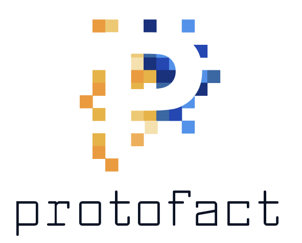

# Protofact

## What It Is

Protofact is an application designed to work with [Uber's Prototool](https://github.com/uber/prototool) as the last
step in a full Protobuf and/or gRPC toolchain. Prototool will compile your code for you, but then you are still
left with language files in no easily consumable form. Protofact generates language-specific artifacts from those files
(gems, jars, npm packages, etc) and uploads them to an artifact store (public or private) so your developers can
`$ bundle add org-proto-files` and get going.

## What Protofact Provides

Protofact is distributed in a few ways. First, you can directly access packages for each language from this repo, and
use them in your own application. Second, we provide pre-built Docker containers for each language you can run on
your own infrastructure with your own configuration.

## How It Works

Let's start with a diagram of the intended architecture.

Your compiled language code generated by `prototool` gets committed to a Github repo. Protofact assumes that in this repo, the generated language-specific code
is in a folder named for that language.

1. There is one webhook on the repo per language you want packaged.
1. The webhooks send a Push event on each commit.
1. For each language you want packaged, there is a Protofact container running that receives the Push event payload.
1. The container creates a unique working directory for each push event received.
1. It clones the code and checks out the commit that triggered the event.
1. It takes other values from the event, as well as config variables set at start time.
1. It uses those values to process templates for each package type, then moves over the language code from the cloned repo.
1. It builds and pushes the artifact.

Protofact assumes that for each language, it is running in an OS environment that also has the CLI tools to package each language.
Ruby should have `ruby` and `gems` installed, Node should have `npm`, Scala should have `sbt`, etc. We provide pre-built containers
for each supported language so you can get going quickly.

### Versioning of Artifacts

Currently, artifacts are versioned with a patch version of the Unix timestamp provided by the Push event. This allows cross-language
package equivalence without resorting to building a complex tracking system of the versions. We are open to more clever suggestions.

## This Could Be More Awesome

We agree! For 0.1.0, we have strived to make this as configurable as possible, but Protofact comes from our internal processes
and their idiosyncracies. For example right now the sbt and Scala versions are locked to what we use. 
We hope members of the community will contribute and make this more flexible, supporting more
languages, and overall better! See our contributing page for details on how to contribute.

### Planned improvements

In no particular order...

- [ ] Node/Typescript support
- [ ] Python support
- [ ] C++ support
- [ ] C# support
- [ ] Objective-C support
- [ ] Java support
